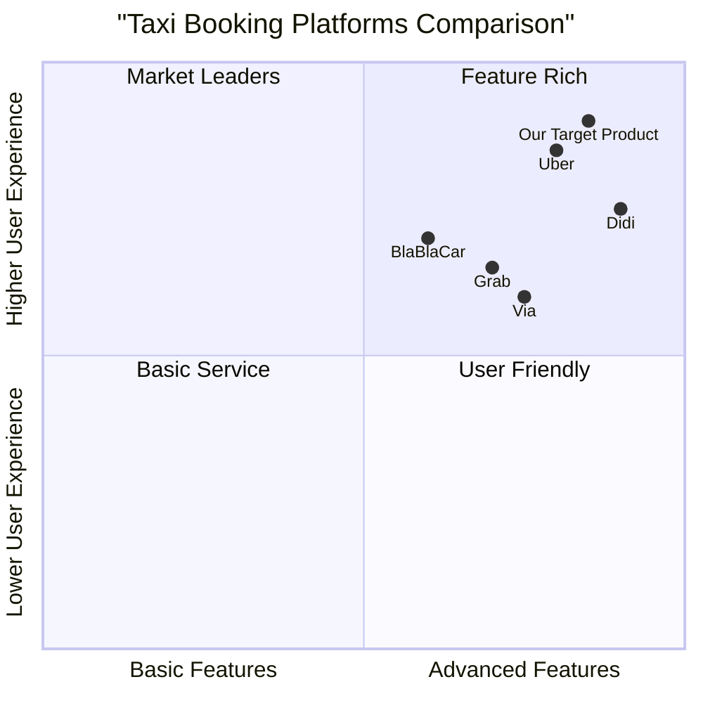
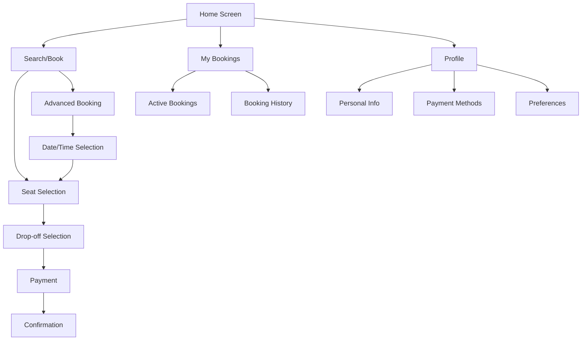

# Online Taxi Booking Management System PRD

## 1. Project Information

- **Project Name**: taxi_booking_system
- **Document Status**: Draft
- **Last Updated**: 2024-03-25

### 1.1 Original Requirements
Develop an online taxi booking management system with the following core functionalities:
- Passengers can book seats in a taxi
- Support for multiple drop-off points
- Real-time seat availability visualization
- Advanced booking capability

## 2. Product Definition

### 2.1 Product Goals
1. Streamline the taxi booking process by providing a user-friendly platform for passengers to book seats with minimal friction
2. Optimize seat utilization and route efficiency through intelligent seat management and drop-off point coordination
3. Enhance user convenience by enabling advance booking capabilities with real-time seat availability

### 2.2 User Stories

1. As a passenger, I want to view available seats in real-time so that I can choose my preferred seating position
2. As a commuter, I want to book a taxi seat in advance so that I can secure my transportation for future trips
3. As a passenger, I want to select my drop-off point from a list of available locations so that I can ensure the taxi will take me to my desired destination
4. As a regular user, I want to view the estimated time of arrival and fare before booking so that I can make informed decisions
5. As a passenger, I want to receive confirmation and reminders about my booking so that I can keep track of my travel arrangements

### 2.3 Competitive Analysis

1. Uber
   - Pros:
     * Robust real-time tracking
     * Wide driver network
     * Seamless payment integration
   - Cons:
     * No advance seat selection
     * Limited shared ride options
     * Higher surge pricing

2. BlaBlaCar
   - Pros:
     * Advance booking system
     * Long-distance focus
     * Cost-effective
   - Cons:
     * Less flexible for immediate rides
     * Limited urban coverage
     * Dependency on driver schedules

3. Via
   - Pros:
     * Multiple passenger coordination
     * Dynamic routing
     * Shared ride focus
   - Cons:
     * Limited market presence
     * Fixed pickup points
     * Less personalization

4. Didi
   - Pros:
     * Advanced AI matching
     * Multiple service types
     * Comprehensive safety features
   - Cons:
     * Complex pricing structure
     * Limited international presence
     * Longer waiting times

5. Grab
   - Pros:
     * Multi-service platform
     * Local market adaptation
     * Reward system
   - Cons:
     * Regional limitations
     * Inconsistent service quality
     * Basic seat selection

### 2.4 Competitive Quadrant Chart

## 3. Technical Specifications

### 3.1 Requirements Analysis

The system requires the following core technical components:

1. Booking Management System
   - Real-time seat inventory management
   - Advanced booking scheduler
   - Dynamic pricing engine
   - Route optimization algorithm

2. User Interface Components
   - Interactive seat selection interface
   - Drop-off point management
   - Booking calendar and time picker
   - Real-time availability updates

3. Backend Services
   - User authentication and authorization
   - Payment processing integration
   - Notification system
   - Data analytics and reporting

### 3.2 Requirements Pool

#### P0 (Must-Have)
1. Seat Booking Core Features
   - Real-time seat availability display
   - Interactive seat selection interface
   - Basic booking flow (select seat, drop-off point, payment)
   - Booking confirmation system

2. Pick-Up Management
   - Multiple pick-up points support
   - Route optimization for multiple pick-ups
   - Clear display of available pick up locations

2. Drop-off Management
   - Multiple drop-off points support
   - Route optimization for multiple stops
   - Clear display of available drop-off locations
   - Estimated time of arrival for each stop

3. User Management
   - User registration and authentication
   - Booking history
   - Basic profile management
   - Payment method management

#### P1 (Should-Have)
1. Advanced Booking Features
   - Future date/time booking capability
   - Recurring booking options
   - Flexible cancellation system
   - Waiting list functionality

2. Enhanced User Experience
   - Real-time tracking of taxi location
   - Push notifications for booking updates
   - Fare estimation before booking
   - Rating and review system

#### P2 (Nice-to-Have)
1. Additional Features
   - Seat preferences saving
   - Social sharing of ride details
   - Multi-language support
   - Loyalty program integration

2. Analytics and Reporting
   - Usage statistics dashboard
   - Popular routes analysis
   - Peak hours identification
   - Customer behavior insights

### 3.3 UI Design Draft

### 3.4 Open Questions

1. Technical Implementation
   - What is the maximum advance booking period?
   - How to handle multiple bookings for the same seat at different times?
   - What happens if a driver cancels an advance booking?

2. Business Rules
   - What is the cancellation policy for advance bookings?
   - How to handle peak hour pricing for advance bookings?
   - What is the minimum notice period for booking modifications?

3. User Experience
   - Should users be able to book multiple seats in one transaction?
   - How to handle waitlist priority for cancelled seats?
   - What level of seat customization should be allowed?

4. System Integration
   - Which payment gateways should be supported?
   - How to integrate with existing taxi dispatch systems?
   - What maps API should be used for route optimization?

## 4. Implementation Timeline

### Phase 1 (Months 1-2)
- Core booking system development
- Basic user interface implementation
- Essential user management features

### Phase 2 (Months 3-4)
- Advanced booking feature integration
- Drop-off point management system
- Payment system integration

### Phase 3 (Months 5-6)
- Enhanced user features
- Analytics implementation
- System optimization and testing

## 5. Success Metrics

1. User Engagement
   - Monthly active users
   - Booking completion rate
   - User retention rate

2. System Performance
   - Average booking time
   - System uptime
   - Response time

3. Business Impact
   - Seat utilization rate
   - Revenue per booking
   - Customer satisfaction score
